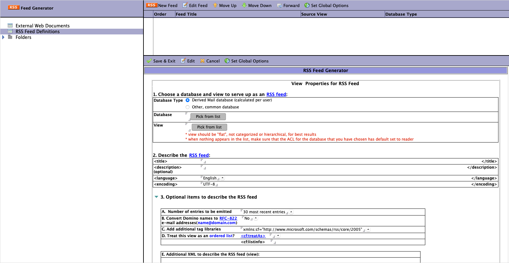

<h1>HCL Domino RSS Feed Generator Template</h1>
This database contains a collection of agents and script-libraries designed to produce RSS feeds

  

    Table of contents
  

  {: .text-delta }
1. TOC
{:toc}

## Info

Property | Value
---|---
Filename | rss_generator.ntf
Templatename | RSS Generator Template
Template version | 9.0
Signed by | Open Source Template/Domino Development
Optimized for | Notes Client 

## Domino RSS Syndication

This database contains a collection of agents and script-libraries designed to produce RSS feeds of any Domino view, including but not limited to:
* E-mail, Calendar, and Contact entries from a user's database
* Corporate contacts
* Discussions

The agents and script-libraries in this database can be copied to a user's mail database (for individual use) or left in this database as a shared application for all users.  As a shared application, special lookup functions find the current webuser's mail database and only create RSS XML for that user.  

## Features

1. Homepage redirects user to "AvailableFeeds" service which advertises all feeds listed in the RSS Feed Definitions view.
2. Only allows user-based RSS feeds when server security is set to "Basic" authentication mode and Anonymous is set to "no access" in this database's ACL.
3. Has an internal function to create iCalendar or vCard objects when the "enclosure" tag is associated with an RSS item
   * iCalendar and vCard objects can be retrieved by examining the "url" property of the "enclosure" tag
   * Since most RSS readers do not process enclosure tags, sending a link to the iCalendar or vCard object reduces the amount of unnecessary data delivered to the client.
   * Visit http://www.rsscalendar.com/rss/  to see similar feeds "enclosure" tags are used by Podcasts to advertise an audio or video file
4. Contacts and Calendar feeds should be advertised as "ordered lists". This means that RSS readers are supposed to remove items that are no longer in the list.  A common example of an "ordered list" is a top-10 feed of best selling books.  The order and content may change on a weekly or monthly basis, and you wouldn't want overlapping #1 books!
5. Has a view to collect and advertise "External Web Documents" as RSS items.  You might use this to aggregate important company documents like Human Resources PDF forms, Corporate policies, and other documents that may not be part of a Domino view.

## How to use
RSS feed generator databases have three primary functions:
* map fields in Domino databases to RSS XML elements
* generate the RSS feeds
* syndicate (advertise) feeds

The rss_generator.ntf is a server-based template and it can only be used on a Domino server. Databases created from the template must reside on the server, and they can only access and generate feeds for databases co-located on the same server.
Databases created from the template must include Anonymous in the ACL, with Reader level privileges, if the RSS feed database is to be used by anyone. Session authentication must be disabled.
User-based RSS feed databases can be created with server security set to 'Basic' authentication mode and Anonymous is set to 'No access.' 
When users open the database, the home page redirects users to an "Available Feeds" page, which advertises all feeds listed in the RSS Feed Definitions view.

### Views
Create and edit RSS feeds in the RSS Feed Definitions view. The order of the feeds in the view is the order in which they appear in the feed list. You can change the order of the feeds in this view, by moving them up or down the list.
Use the 'External Web documents' view to collect and advertise Web-enabled documents as RSS items. For example, you might use this to aggregate important company documents like Human Resources PDF forms, Corporate policies, and other documents that may not be part of a Domino view.

## Setting up an RSS feed generator database
Create the database from the template, as described in Domino Administrator Help.
In the RSS Field Definitions view, click New Feed. The New RSS Feed Definition form appears.
First, choose the database to serve up as an RSS feed. 

For more detailed information about configuration settings, please refer to the Using document within the application.